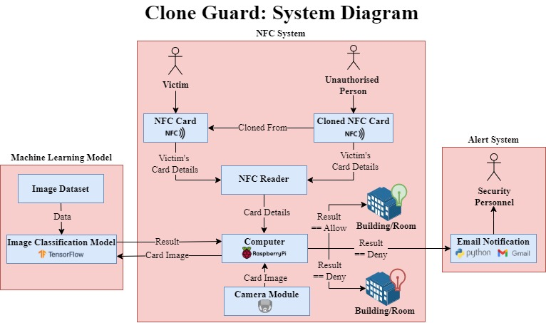

<div align="center">


## Introduction

This project seeks to accurately classify NFC-Cards based on their visual features to complement and fortify NFC-based access control systems. The solution involves utilised supervised machine learning classifiation techniques and algorithms along with an embedded alert system . The significance of this approach lies in its automated capability to restrict access to potentially cloned cards without requiring users to provide secondary identification (e.g.  biometrics) whilst also providing cloning event alerts. The project’s scope operates under the assumption that stakeholder access systems have distinguishable cards or tags that are used by all users or employees.

</div>

## Development Environment

To successfully run this project the following tools and libraries are required:

### Software

- [Python](https://www.python.org/downloads/release/python-3111/) *(version: 3.11.1)*
- [git](https://github.com/git-guides/install-git) *(version: 2.39.0)*

### Hardware

- Raspberry Pi *(confirmed to work on both Model 4b & 5)*
- NFC Module MFRC522
- Mifare Classic 1K NFC cards
- Green LED
- Red LED
- Raspberry Pi Camera Module 2
- 11 Wires (Female to Female)

### Third Party Libraries & Add Ons

To interact with the MFRC522 NFC Module, the MFRC522 python library is required. For compatibility with Raspberry Pi 5, [this](https://github.com/danjperron/MFRC522-python) forked repo has been linked as a git sub module.

## Getting Started

### Fresh Raspberry Pi Setup

1. Insert the micro SD card into an external laptop with [Raspberry Pi OS Imager](https://www.raspberrypi.com/software/)

2. Launch the software and select the device you have access to, the recommended OS and the external location to write the image to.

> [!WARNING]
> This will override everything on the card

3. Once Write is complete, remove the SD Card and insert into the Raspberry Pi. Connect power and monitor cables. Allow OS to boot.

### Setting Up Remote Access (optional)

1. Connect Raspberry Pi to a network

2. Click on the icon in the top right of the navbar

3. Sign in & follow the prompts to set up the device

4. On another device you will now be able to log into [Raspberry Pi Connect](https://connect.raspberrypi.com/devices) and connect to the device via remote shell or Screen sharing.

### Setting Up Camera Module

1. Connect camera module to Raspberry Pi.
   - For Raspberry Pi Model 4b, follow [guides](https://www.raspberrypi.com/documentation/accessories/camera.html#install-a-raspberry-pi-camera).
   - For Raspberry Pi 5, using the Raspberry Pi Camera FPC Adapter Cable 200mm follow this [video](https://www.youtube.com/watch?v=LPC4ftpdc-4&t=465s).

2. Ensure OS Software is up to date. (No other software is required)

3. Connect Raspberry Pi to power.

4. Open a terminal and enter in `rpicam-hello` and a camera preview should be shown.

See additional [commands and flags](https://www.raspberrypi.com/documentation/computers/camera_software.html#rpicam-apps).

### [Setting up NFC Module](https://pimylifeup.com/raspberry-pi-rfid-rc522/)

1. Connect pins as shown below:

| Raspberry Pi 5 | MFRC522 Module | Red LED  | Green LED |
|:--------------:|:--------------:|:--------:|:---------:|
|       1        |      3.3V      |    -     |     -     |
|       6        |      GND       |    -     |     -     |
|       9        |        -       |  Ground  |     -     |
|      11        |        -       | Positive |     -     |
|      12        |        -       |    -     |  Positive |
|      14        |        -       |    -     |  Ground   |
|      19        |      MOSI      |    -     |     -     |
|      21        |      MISO      |    -     |     -     |
|      22        |      RST       |    -     |     -     |
|      23        |      SCK       |    -     |     -     |
|      24        |      SDA       |    -     |     -     |


1. Plug in Raspberry Pi.
2. Open the terminal and enter in `sudo raspi-config`.
3. Use the arrow keys to select `3 Interface Options`. Press Enter.
4. Use the arrow keys to select `SPI`. Press enter.
5. Select `Yes` in the popup. Press enter.
6. Reboot the system before proceeding by running `sudo reboot`.
7. Once rebooted, confirm that SPI has been enabled by running `lsmod │ grep spi`. If spi_bcm2835 is shown in the list, proceed. Otherwise consult troubleshooting docs.

### Cloning & Running Project For the First Time

1. Install required python packages by running `sudo apt install python3-dev python3-pip python3-venv`
2. Clone the repository by entering `git clone https://github.com/daniegee/clone-guard.git`.
3. Change directory `cd clone-guard`.
4. Create a Virtual Python Environment by running `python3 -m venv env`.
5. Start the virtual environment by running `source env/bin/activate`.
6. Give the setup script executable permissions `chmod +x setup.sh`
7. Initialise the git submodule & install required packages by running the custom script `./setup.sh`.
8. Create and populate an `.env` file based off the variables defined in `.env.template`
9.  Run the main script `python main.py`
10. Place the card near the reader, and it should display the card UID in the terminal.

### Re-Running Existing Project

*Conditions: project repo has been initialised and run at least once*

1. Open terminal and change into the repo's root directory `cd clone-guard-part-b`
2. Start the virtual environment by running `source env/bin/activate`.
3. Make script callable by running `chmod +x ./setup.sh`
4. Initialise the git submodule & install required packages by running the custom script `./setup.sh`.
5. Run the main script `python main.py`
6. Place the card near the reader, and it should display the card UID in the terminal.

## System Diagram



## Repo Structure

```bash
├── 3D models # 3D model blueprint used in the project
│   └── Case.gcode
│
├── classes # collection of classes used in the project
│   ├── EmailSender.py
│   ├── GradCAM.py
│   ├── LEDController.py
│   └── TFLiteImageClassifier.py
│
├── diagrams # Visualisations that show the current/updated state of the project
│   ├── CNN_model_architecture.png
│   ├── MFRC522_configuration_visual.png
│   └── pin_configuration_table.png
│
├── images # Images used to train, validate & test the model
│   ├── controlled_background # image dataset with controlled white background
│   │   └── ...
│   └── noise_background # image dataset with noisy background
│       └── ... 
│
├── MFRC55-python
│   └── ... # Git SubModule
│
├── notebooks
│   ├── CNN.ipynb # Juypter notebook implementing a Convolution Neural Network (CNN) used in the project
│   ├── KNN.ipynb # Juypter notebook implementing a K-Nearest Neighbour (KNN) used in the project
│   └── SVM.ipynb # Juypter notebook implementing a Support Vector Machine (SVM) used in the project
│
├── scripts
│   └── cameraphotos.py # script used to automate image dataset collection
│
├── .gitignore
│
├── .gitmodules
│
├── main.py
│
├── README.md
│
├── requirements.txt # list of python dependencies
│
└── setup.sh # Script to install dependencies
```

## Contributors

David Prego

Daniella Gullotta
